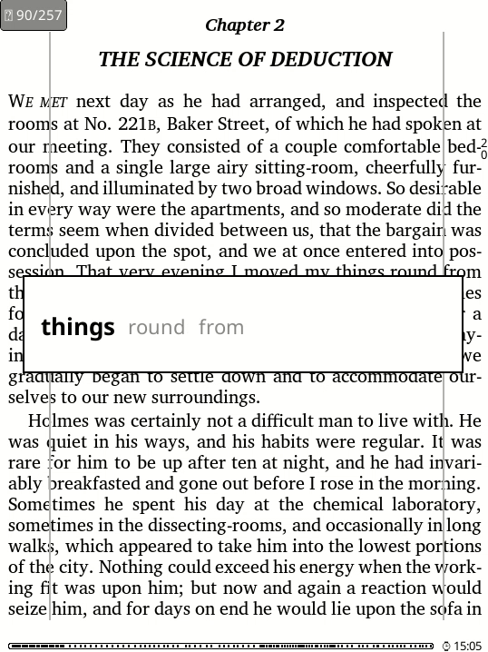
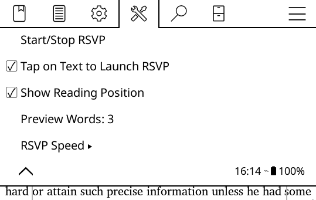

# FastReader Plugin for KOReader

A powerful RSVP (Rapid Serial Visual Presentation) plugin that enables speed reading with advanced features for KOReader.

## Features

- Tap-to-Launch RSVP: Tap directly on text to instantly start RSVP reading
- Resume Reading: Automatically remembers your last reading position on each page
- Flexible Speed Control: Adjustable reading speed from 50 to 1000 WPM
- Multi-Word Preview: Display multiple words simultaneously (1-10 words configurable)
- Fixed-Width Display: Stable reading widget that doesn't "jump" between words
- Position Tracking: Visual indicator shows reading progress when resuming
- Seamless Page Transitions: Automatically continues to next page when reaching end

## Screenshots

### RSVP Reading Widget

### Settings Menu

## Installation

1. Copy the `fastreader.koplugin` folder to your KOReader plugins directory
2. Restart KOReader
3. Enable the plugin in Settings → Plugins → FastReader

## Usage

### Quick Start
1. **Enable Tap-to-Launch**: Settings → FastReader → "Tap on Text to Launch RSVP"
2. **Set your speed**: Settings → FastReader → "RSVP Speed"
3. **Tap on any text** to start speed reading
4. **Tap the reading widget** to stop

### Manual Start
- Go to Settings → FastReader → "Start/Stop RSVP"
- Or use the assigned gesture if configured

### Controls During Reading
- **Tap anywhere on the reading widget** to stop RSVP
- **Menu/Back button** to stop RSVP
- **Page forward/back** to navigate (if RSVP is paused)
- **Tap elsewhere** to stop and return to normal reading

## Settings

### Main Settings
- **Start/Stop RSVP**: Manual control for RSVP reading
- **Tap on Text to Launch RSVP**: Enable/disable tap-to-start functionality
- **Show Reading Position**: Toggle position indicator when resuming
- **Preview Words**: Set number of words to display (1-10)
- **RSVP Speed**: Comprehensive speed control options

### Speed Presets
- **100 WPM**: Very slow (beginners)
- **150 WPM**: Slow (comfortable reading)
- **200 WPM**: Normal (average reading speed)
- **250 WPM**: Fast (experienced readers)
- **300 WPM**: Very fast (advanced users)
- **400 WPM**: Extreme (speed reading experts)
- **500 WPM**: Ultra fast (maximum speed)

## Tips for Effective Speed Reading

1. **Start Slow**: Begin with 150-200 WPM and gradually increase
2. **Focus on Comprehension**: Speed is useless without understanding
3. **Use Preview Words**: Set to 3-5 words for better context
4. **Regular Practice**: Consistency improves reading speed over time
5. **Minimize Subvocalization**: Avoid "hearing" words in your head
6. **Use Resume Feature**: Take breaks and resume exactly where you left off

## Troubleshooting

### RSVP Won't Start
- Ensure the document has extractable text
- Try manually starting RSVP from the menu first
- Check that tap-to-launch is enabled in settings

### Text Extraction Issues
- Some PDF files may have non-extractable text
- Try converting to EPUB format for better compatibility
- Ensure the document is not password-protected

### Performance Issues
- Reduce preview word count if the interface feels slow
- Lower the reading speed if words appear too quickly
- Restart KOReader if the plugin becomes unresponsive

## Technical Details

- **Supported Documents**: PDF, EPUB, MOBI, and other text-based formats
- **Memory Efficient**: Minimal resource usage during operation
- **Page Tracking**: Uses content hashing for reliable position tracking
- **UTF-8 Compatible**: Works with international characters and languages

## License

This plugin is distributed under the same license as KOReader.

## Contributing

Contributions are welcome! Please submit issues and pull requests through the appropriate channels.

---

**Enjoy your enhanced reading experience with FastReader!** 📚⚡
